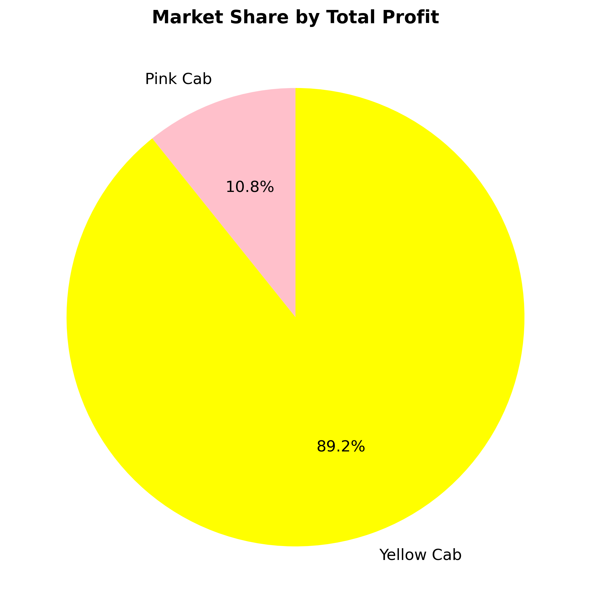
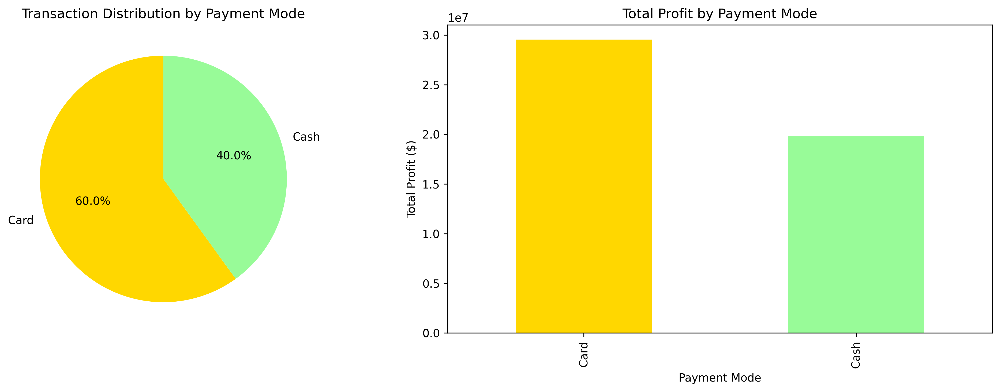
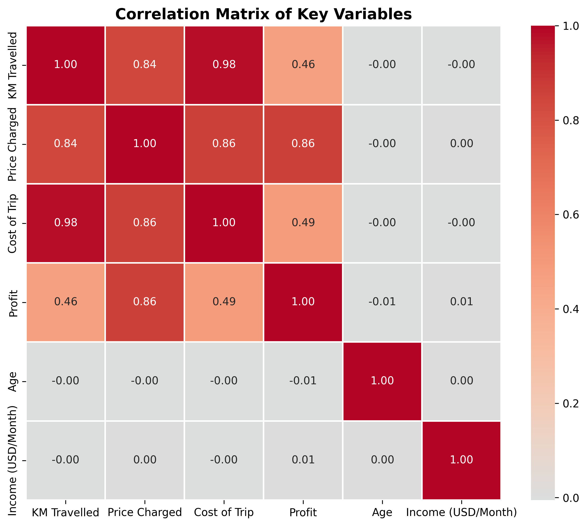

# Taksi Şirketi Karlılık Analizi

## Proje Özeti

Bu proje, Amerika Birleşik Devletleri'nde 20 büyük şehirde faaliyet gösteren iki taksi şirketinin (Yellow Cab ve Pink Cab) kapsamlı bir analizini sunmaktadır. Analiz, işlem verilerini, müşteri demografisini ve şehir düzeyindeki istatistikleri birleştirerek karlılık modellerini ve iş içgörülerini ortaya çıkarmaktadır.

## İş Soruları

Bu analiz aşağıdaki temel soruları ele almaktadır:

1. Hangi şirket genel olarak daha karlı ve neden?
2. Her şirket için en karlı ve en az karlı pazarlar hangileri?
3. Müşteri demografisi (yaş, cinsiyet, gelir) harcama modellerini nasıl etkiliyor?
4. Tercih edilen ödeme yöntemi nedir ve karlılığı etkiliyor mu?
5. Hangi şehirler nüfus ve kullanıcı tabanına göre en iyi kar verimliliğini sunuyor?

## Veri Seti Açıklaması

Analiz, birbiriyle bağlantılı dört veri setini kullanmaktadır:

- **Cab_Data.csv** (359,392 kayıt): Şirket, şehir, kat edilen mesafe, fiyatlandırma ve maliyetler dahil işlem düzeyinde veriler
- **Customer_ID.csv** (49,171 kayıt): Yaş, cinsiyet ve aylık gelir bilgilerini içeren müşteri demografisi
- **Transaction_ID.csv** (440,098 kayıt): Her işlem için ödeme yöntemi bilgileri
- **City.csv** (20 kayıt): Nüfus ve kayıtlı kullanıcılar dahil şehir düzeyinde istatistikler

## Metodoloji

1. **Veri Hazırlama**: Birden fazla veri seti birleştirildi, veri tipleri temizlendi ve biçimlendirme sorunları giderildi
2. **Karlılık Hesaplaması**: Kar, tahsil edilen fiyat ile seyahat maliyeti arasındaki fark olarak hesaplandı
3. **Segmentasyon Analizi**: Şirketler, şehirler ve müşteri demografisi bazında performans analiz edildi
4. **Verimlilik Metrikleri**: Pazar büyüklüğünü normalize etmek için kullanıcı başına kar ve kişi başına kar hesaplandı

## Temel Bulgular

### Şirket Performansı
- Yellow Cab toplam kar bazında %89.2 pazar payı ile dominant konumda ($44.0M vs $5.3M)
- Yellow Cab ayrıca işlem başına daha yüksek ortalama kar elde ediyor ($160.26 vs $62.65)

### Coğrafi İçgörüler
- New York City her iki şirket için de en yüksek mutlak karı üretiyor
- Pittsburgh ve Phoenix gibi daha küçük şehirler kullanıcı başına daha yüksek kar verimliliği gösteriyor
- İlk 5 şehrin karların çoğunluğunu oluşturduğu pazar yoğunlaşması belirgin

### Müşteri Demografisi
- Cinsiyet dağılımı erkek ve kadın müşteriler arasında dengeli işlem modelleri gösteriyor
- 26-35 yaş grubu en yüksek değerli müşteri segmentini temsil ediyor
- Ödeme tercihleri nakit ve kart arasında bölünmüş durumda, minimal kar farkı var

### Pazar Verimliliği
- Kullanıcı başına kar şehirler arasında önemli ölçüde değişiyor, bu da pazar doygunluğu farklılıklarını gösteriyor
- Nüfus büyüklüğü karlılıkla doğrudan ilişkili değil, bu da hizmet kalitesi ve fiyatlandırmanın daha önemli olduğunu gösteriyor

## Görselleştirmeler

### 1. Şirket Performansı


### 2. Coğrafi Analiz


### 3. Verimlilik Metrikleri


### 4. Pazar Payı


### 5. Demografik Analiz




### 6. Korelasyon Analizi


## Kullanılan Teknolojiler

- **Python 3.x**
- **pandas**: Veri manipülasyonu ve agregasyon
- **numpy**: Sayısal hesaplamalar
- **matplotlib**: Veri görselleştirme
- **seaborn**: İstatistiksel grafikler
- **Jupyter Notebook**: İnteraktif analiz ortamı

## Nasıl Çalıştırılır

1. Bu depoyu klonlayın
2. Python 3.x ve gerekli kütüphanelerin kurulu olduğundan emin olun:
   ```bash
   pip install pandas numpy matplotlib seaborn jupyter
   ```
3. Jupyter Notebook'ta `taxi_project.ipynb` dosyasını açın
4. Tüm hücreleri sırayla çalıştırın

## Kısıtlamalar ve Gelecek Çalışmalar

### Mevcut Kısıtlamalar
- Veri seti zamana bağlı trendler içermeyen bir anlık görüntüyü temsil ediyor
- 20 şehirle sınırlı, tüm pazarları temsil etmiyor olabilir
- Seyahat süresi, müşteri memnuniyeti veya sürücü metrikleri verisi yok

### Potansiyel İyileştirmeler
- Mevsimsel desenleri ve trendleri belirlemek için zaman serisi analizi
- Talep tahmini için tahmine dayalı modelleme
- Kümeleme teknikleri kullanarak müşteri segmentasyonu
- Sürücü performansı ve verimlilik analizi
- Rota optimizasyon önerileri

## Sonuç

Bu analiz, Yellow Cab'in çoğu metrikte açık rekabet avantajlarına sahip olduğunu göstermektedir. Ancak Pink Cab için rekabetçi verimlilik gösterdiği belirli pazarlarda fırsatlar mevcuttur. Demografik içgörüler, hedefli pazarlama ve hizmet optimizasyon stratejileri için eyleme geçirilebilir bilgiler sunmaktadır.
