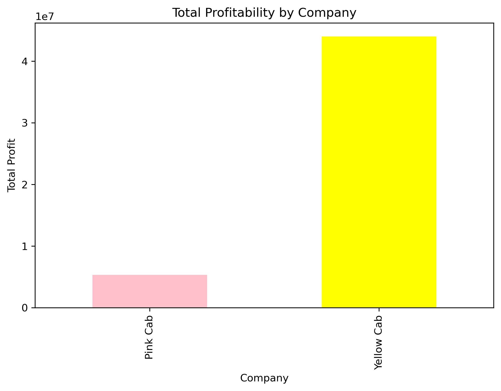
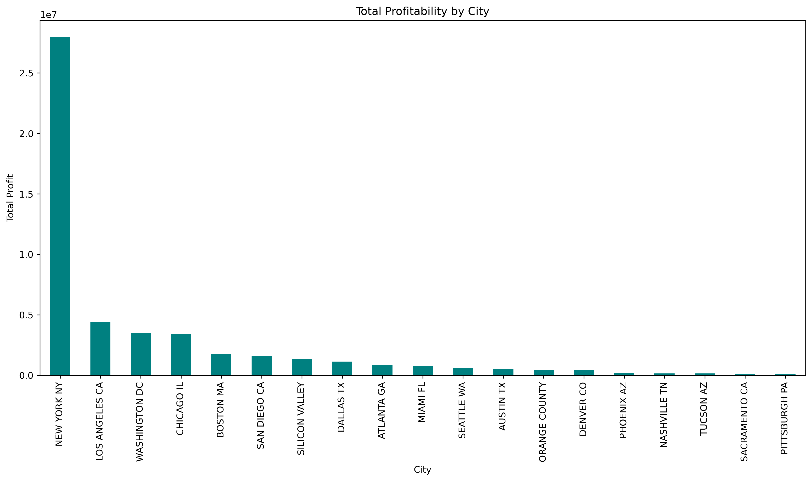
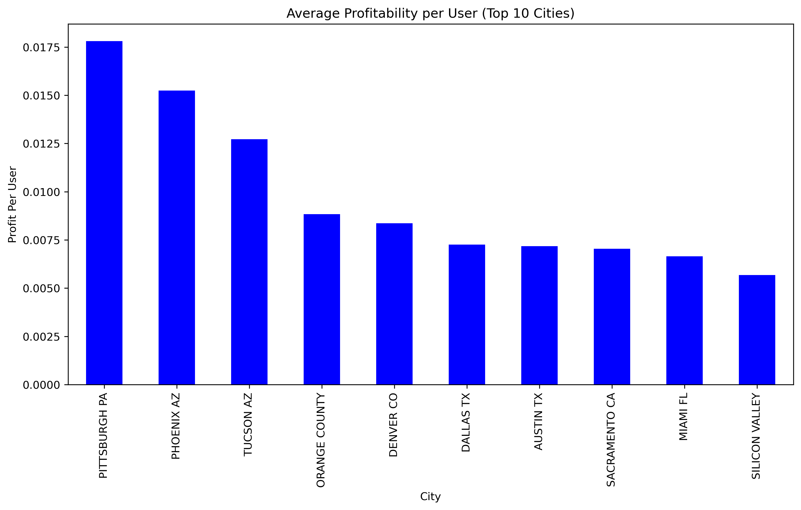
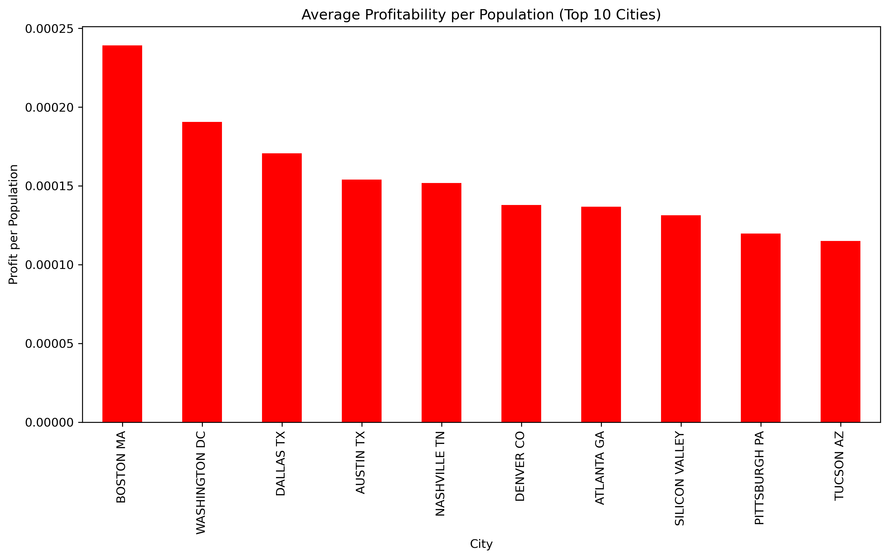
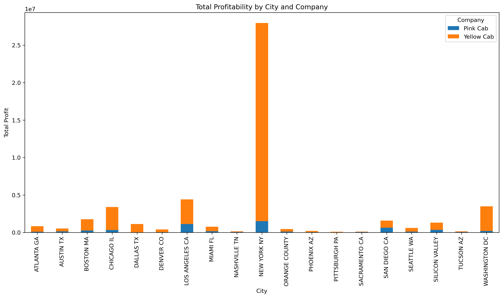

# Taxi Company Analysis

This project analyzes two taxi companies, Yellow Cab and Pink Cab, to determine the best investment opportunity based on profitability and user metrics.

## Project Structure
- `taxi_project.ipynb`: Jupyter Notebook containing the analysis and visualizations.
- **Data Files**:
  - `Cab_Data.csv`
  - `City.csv`
  - `Customer_ID.csv`
  - `Transaction_ID.csv`
- **Generated Visuals**:
  - 
  **Figure 1:** This graph shows the total profitability of Yellow Cab and Pink Cab. Yellow Cab outperforms Pink Cab significantly.

    

  - 

  - 

  - 
  -

## Key Findings
1. **Yellow Cab** outperforms **Pink Cab** in total profitability, making it a better investment option.
2. Key cities with high profitability include New York and Boston.
3. Recommendations:
   - Focus on investing in Yellow Cab.
   - Optimize operations in cities with lower profitability for Pink Cab.