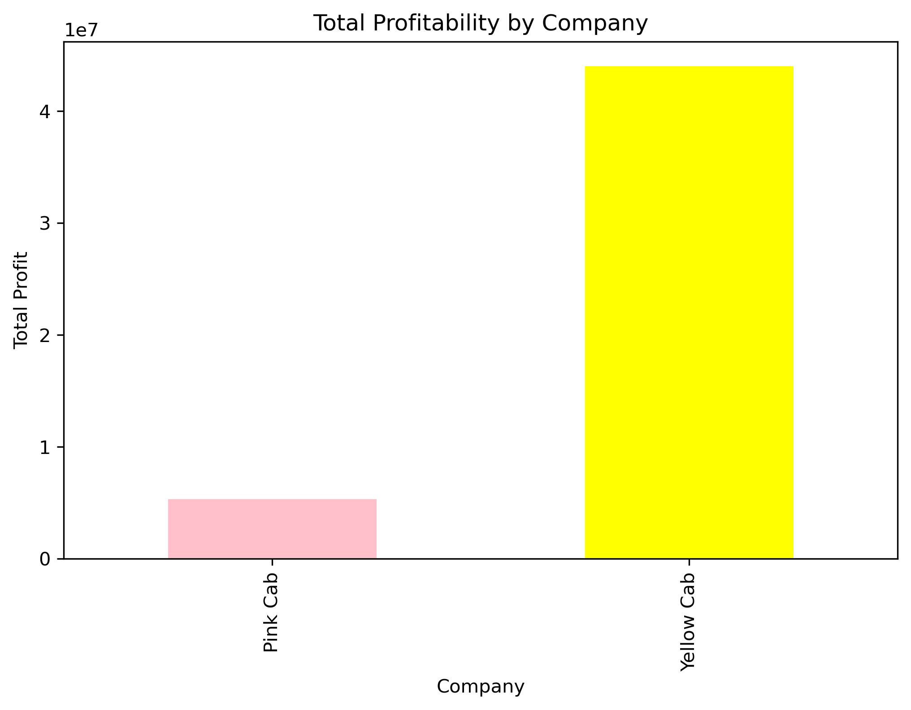
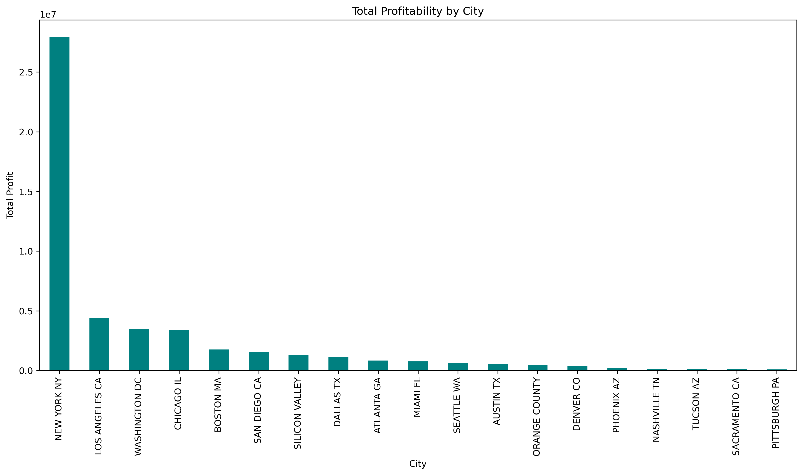
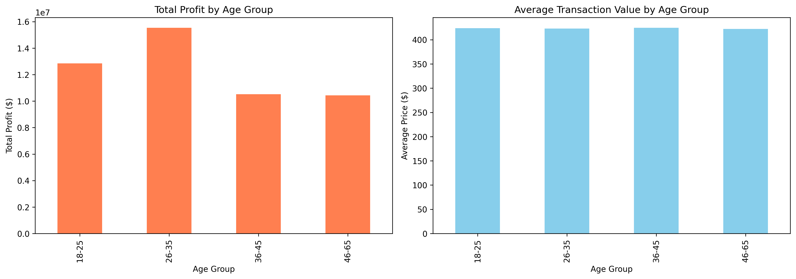
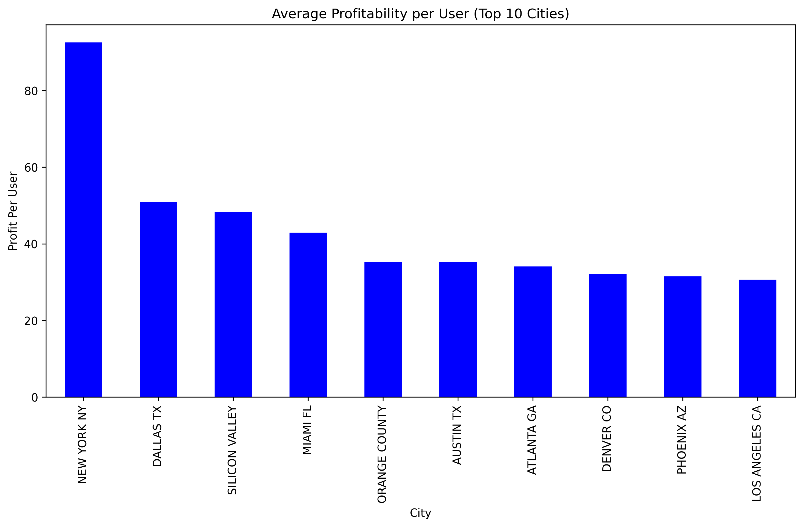

# Taksi Şirketi Karlılık Analizi

ABD'deki iki taksi şirketinin (Yellow Cab ve Pink Cab) işlem verilerini analiz ettim. 20 şehirde toplam 359k işlem kaydı, müşteri demografisi ve şehir istatistiklerini kullanarak karlılık modellerini inceledim.

## Veri Seti

- **Cab_Data.csv** (359,392 kayıt): Şirket, şehir, mesafe, fiyat ve maliyet bilgileri
- **Customer_ID.csv** (49,171 kayıt): Müşteri demografisi (yaş, cinsiyet, gelir)
- **Transaction_ID.csv** (440,098 kayıt): Ödeme yöntemi bilgileri
- **City.csv** (20 kayıt): Şehir nüfusu ve kayıtlı kullanıcı sayıları

## Analiz Soruları

- Hangi şirket daha karlı ve neden?
- Şehirlere göre karlılık nasıl değişiyor?
- Müşteri demografisi (yaş, cinsiyet, gelir) karlılığı nasıl etkiliyor?
- Ödeme yöntemleri arasında anlamlı fark var mı?
- Kullanıcı ve nüfus başına verimlilik nasıl?

## Yöntem

Pandas ile 4 veri setini birleştirip temizledim. Karlılığı "fiyat - maliyet" formülüyle hesapladım. Şirket, şehir ve müşteri demografisine göre segmentasyon yaptım. Pazar verimliliğini karşılaştırmak için kullanıcı başına ve nüfus başına kar metriklerini kullandım.

## Temel Bulgular

**Şirket Performansı**
- Yellow Cab toplam karda %89.2 pazar payına sahip (44.0M$ vs 5.3M$)
- İşlem başına ortalama kar da Yellow Cab'de daha yüksek (160$ vs 63$)

**Coğrafi Analiz**
- NYC toplam karda lider ama Pittsburgh ve Phoenix kullanıcı başına daha verimli
- İlk 5 şehir toplam karın büyük kısmını oluşturuyor

**Müşteri Demografisi**
- 26-35 yaş grubu en değerli segment
- Cinsiyet bazında işlem dağılımı dengeli
- Nakit ve kart kullanımı karlılıkta anlamlı fark yaratmıyor

**Verimlilik**
- Nüfus büyüklüğü karlılıkla doğrudan ilişkili değil
- Kullanıcı başına kar şehirler arasında önemli farklılık gösteriyor

## Teknolojiler

Python, pandas, numpy, matplotlib, seaborn, Jupyter Notebook

## Sonuç

Yellow Cab karlılık ve pazar payında belirgin üstünlüğe sahip. Pink Cab bazı küçük pazarlarda rekabetçi verimlilik gösteriyor. Demografik bulgular hedefli pazarlama için kullanılabilir.

Diğer görseller `images/` klasöründe bulunuyor.
