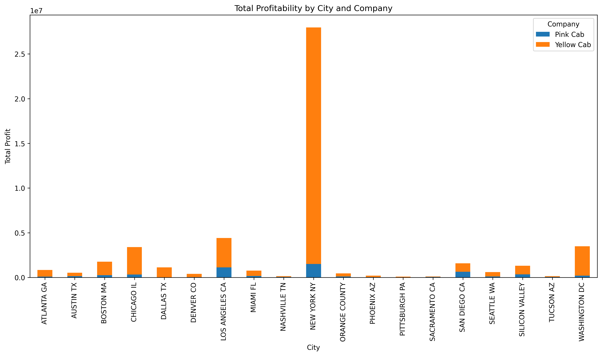
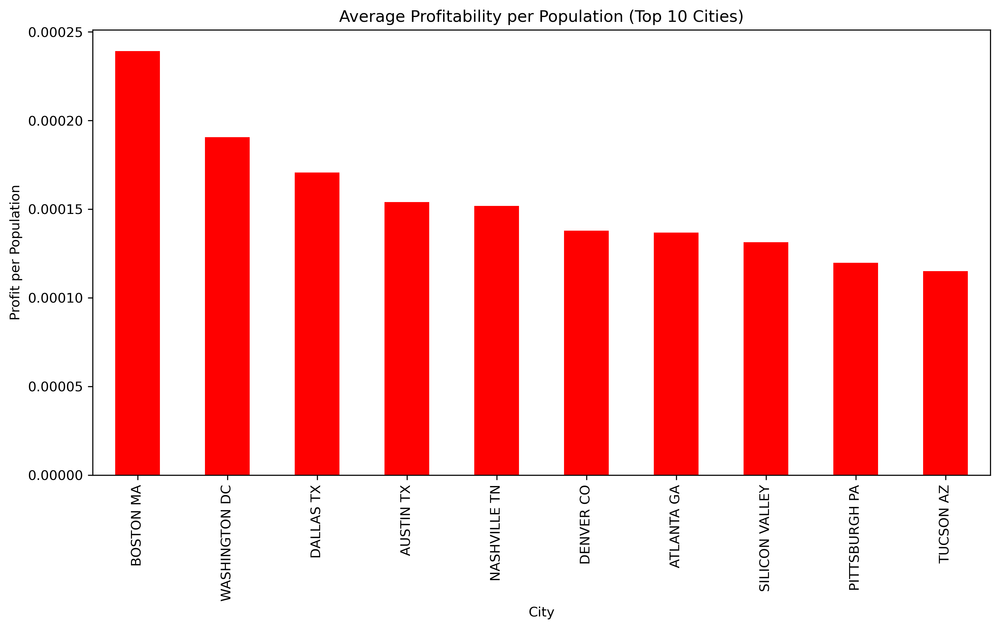

# Taxi Company Analysis

This project analyzes the profitability of two taxi companies, Yellow Cab and Pink Cab, across various cities in the United States. The objective is to identify trends and key insights into their profitability.

## Objective

To provide a comparative analysis of the profitability of two taxi companies based on city-wide and user-level data.

## Dataset

The dataset contains the following key information:
- Transaction details (e.g., payment, company, city)
- Customer demographics
- City population and profitability statistics

## Key Features

1. **Profitability by Company**  
   This analysis compares the total profitability of Yellow Cab and Pink Cab.  
   

2. **Profitability by City**  
   The chart showcases the total profitability of both companies across different cities.  
   

3. **Profitability by City and Company**  
   This graph compares the profitability of both companies in individual cities.  
   

4. **Top 10 Cities by Profit per Population**  
   Highlights the cities with the highest profit per population.  
   

5. **Top 10 Cities by Profit per User**  
   Highlights the cities with the highest profit per user.  
   

## Tools Used

- Python
- Pandas, Matplotlib, Seaborn for data analysis and visualization
- Jupyter Notebook

## Insights

- Yellow Cab consistently outperforms Pink Cab in profitability.
- New York City is the most profitable city for both companies.
- Cities like Boston and Washington D.C. stand out in terms of profit per population.

## Repository

The project includes:
- **Dataset files:** `Cab_Data.csv`, `Transaction_ID.csv`, `City.csv`, etc.
- **Visualizations and graphs** as shown above.
- **Analysis notebook:** The main analysis and insights are documented in `taxi_project.ipynb`.
